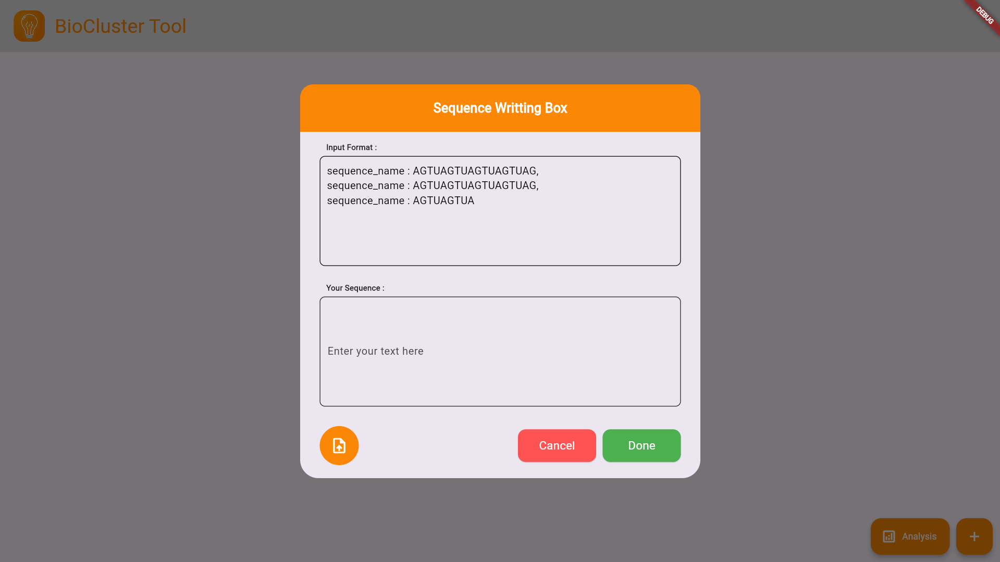
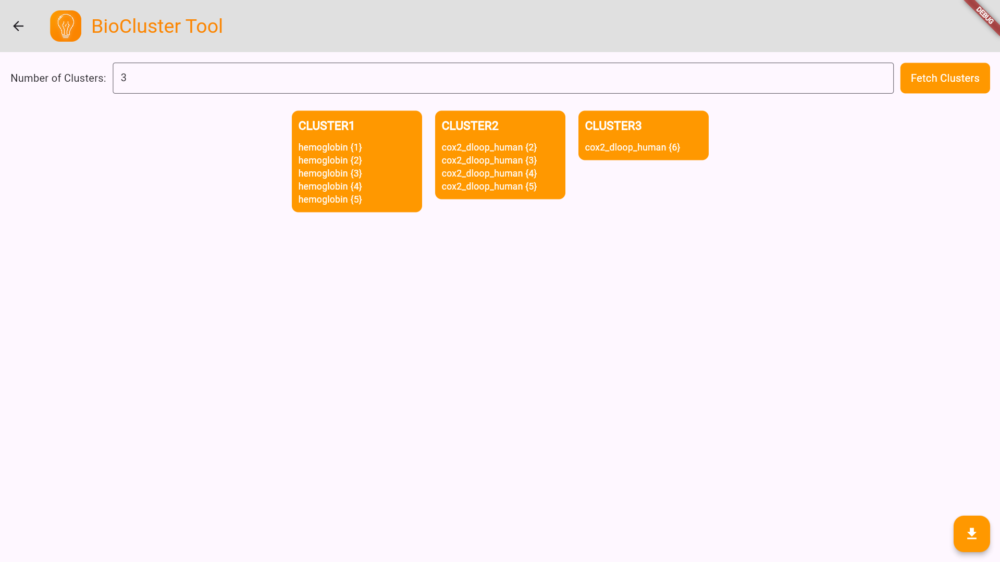

# 🧬 BioCluster Tool – Interactive Bioinformatics Web App

**BioCluster Tool** is a modern, Flutter-based web interface designed for the **analysis and clustering of nucleotide sequences**. Built to work seamlessly with a FastAPI backend, it brings user-friendly bioinformatics to researchers, students, and developers.




---

## 🗂 Project Structure

```bash
BioCluster-Tool/
├── biocluster/          # Flutter-based frontend for the web app
│   ├── lib/                  # Dart source code (main UI and logic)
│   ├── assets/               # Static assets (images, logos, etc.)
│   ├── web/                  # Web-specific files (HTML, manifest)
│   ├── pubspec.yaml          # Flutter dependencies and metadata
│   └── test/                 # Test files for the Flutter app
├── flask-backend/            # FastAPI-based backend for processing
│   ├── main.py               # Entry point for the FastAPI application
│   ├── routes/               # API route definitions
│   ├── utils/                # Utility functions for sequence analysis
│   ├── pyproject.toml        # Python dependencies and metadata
│   └── README.md             # Backend-specific documentation
├── web/                      # Built Flutter web app for deployment
│   ├── index.html            # Entry point for the web app
│   ├── main.dart.js          # Compiled Dart code
│   ├── assets/               # Static assets for the web app
│   ├── icons/                # App icons
│   └── manifest.json         # Web app manifest
├── README.md                 # Main project documentation
├── LICENSE                   # License information
└── sequences.txt             # Example input file for sequences
└── cluster.txt             # Example output cluster file for sequences
```

---

## 🛠 Getting Started

Follow these steps to run the app locally:

### Clone the Repository

```bash
git clone https://github.com/self-Puneet/BioCluster-Tool
```

### Frontend Setup

Once you have built the Flutter web app, a `web` folder will be generated in the root directory. Follow these steps to serve the web app locally:

1. Ensure you have Node.js installed on your system. If not, download and install it from [Node.js Official Website](https://nodejs.org/).
2. Install the `serve` package globally using npm:
   ```bash
   npm install -g serve
   ```
3. Navigate to the root directory of the project where the `web` folder is located.
4. Serve the web app using the `serve` command:
   ```bash
   serve web
   ```
5. Open your browser and go to the URL provided by the `serve` command (e.g., `http://localhost:5000`) to view the web app.

### Backend Setup

```bash
# 1. Navigate to the backend directory
cd flask-backend

# 2. Install the required Python packages
pip install -r requirements.txt

# 3. Start the FastAPI server using Uvicorn
uvicorn main:app --reload
```

> ⚠️ **Make sure the backend server is running** (see backend setup above).

---

## 📄 Input and Output Text Document Formats

### Input File Format
The input file should be a text file containing sequences and their respective names in the following format:

```
cox2_dloop_human {2} : WTYEYTDYGGLILTTCST
cox2_dloop_human {3}  : WTYEYTDYTCST
cox2_dloop_human {4} : WTYEYTDYGGLILTTCST
cox2_dloop_human {5} : WTYEYTDYGGLIFNSYMLPTTCST
cox2_dloop_human {6} : WTYEYTDYGGLIFNSYEYCTVP
hemoglobin {1} : MVHLTPEEKSAVTALNALAHKYH
hemoglobin {2} : MVHLTGEEKSAVTLAHKYH
hemoglobin {3}: MVHLTPEEKNAVANALAHKYH
hemoglobin {4} : HLTPEEKSAVTAANALA
hemoglobin {5}: MVHLTPEEKTAVANALAHKYH
```

### Output File Format
The output file will contain the clustering results in the following format:

```
cluster1:
  hemoglobin {1}: MVHLTPEE...KYH
  hemoglobin {2}: MVHLTGEE...HKYH
  hemoglobin {3}: MVHLTPEE...AHKYH
  hemoglobin {4}: HLTPEEKSAV...ALA
  hemoglobin {5}: MVHLTPEEKTAVTTL...ALAHKYH

cluster2:
  cox2_dloop_human {2}: WTYEYTDYG...TTCST
  cox2_dloop_human {3}: WTYEYTDY...TLLPAT
  cox2_dloop_human {4}: WTYEYTD...IVRYHKYLTTCST
  cox2_dloop_human {5}: WTYEYTD...RYHKYLTTCST

cluster3:
  cox2_dloop_human {6}: WTYEYTDYGG...YCTVP

```

---

## 💬 Feedback & Contributions

We welcome contributions! Please open issues or submit pull requests to improve the functionality or design.

---

## 📜 License

This project is licensed under the MIT License. See the [LICENSE](../LICENSE) file for details.
